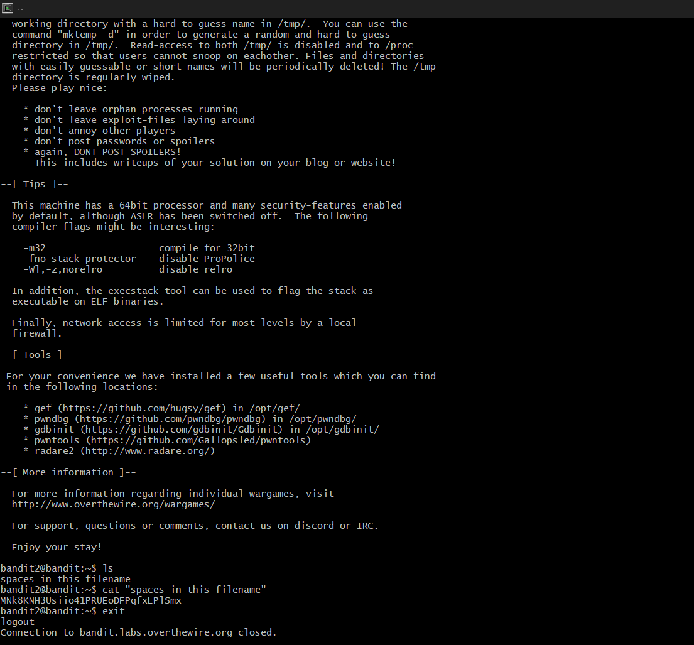

# Bandit Level 2 --> Level 3

#### Goal: Find a file with spaces in its name to get the password inside it. 
#### Username: bandit3
#### Password: MNk8KNH3Usiio41PRUEoDFPqfxLPlSmx
#### Steps: Password is in the file 'spaces in this filename'. It's accessed using the command 'cat "spaces in this filename"', where we enclose the filename in "" to be able to access it. 

