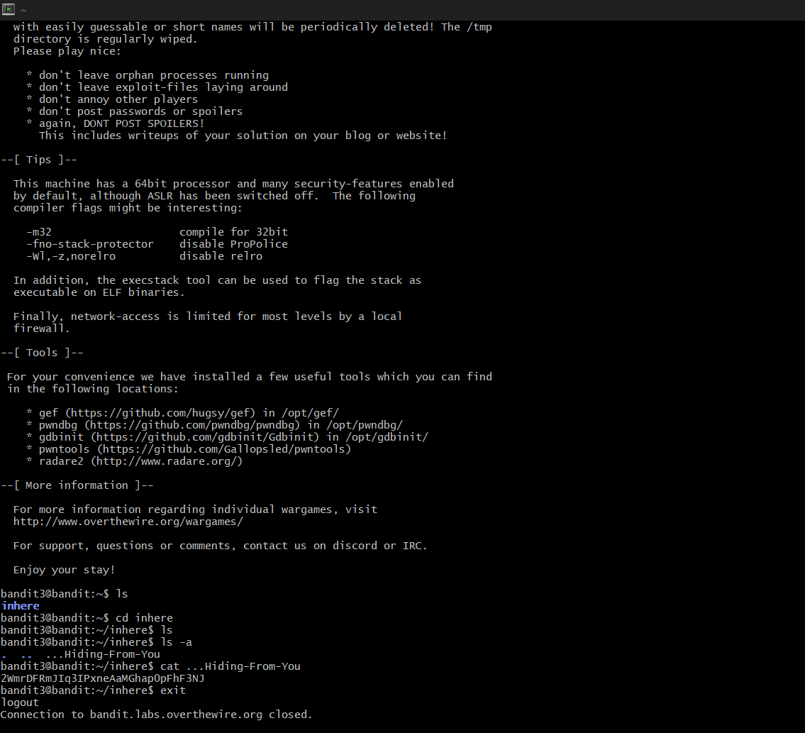

# Bandit Level 3 --> Level 4
#### Goal: Find the password stored in a hidden file in the 'inhere' directory. 
#### Username: bandit4
#### Password: 2WmrDFRmJIq3IPxneAaMGhap0pFhF3NJ
#### Steps: After entering the 'inhere' directory, to view the hidden files use 'ls -a'. All hidden files have a '.' in front of their names. The password is in the file '...Hiding-From-You' which is accessed with 'cat ...Hiding-From-You'. 

