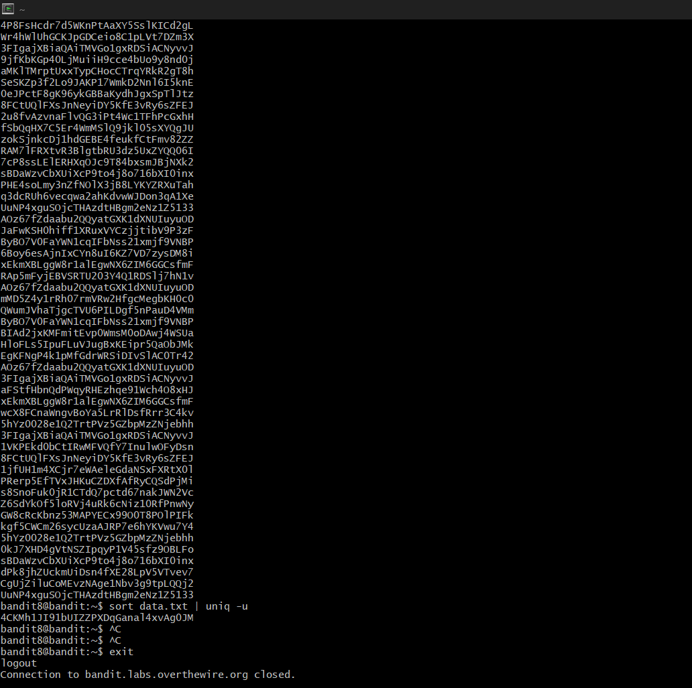

# Bandit Level 8 --> Level 9
#### Goal: Find the password in data.txt file by searching for the line that only occurs only once. 
#### Username: bandit9
#### Password: 4CKMh1JI91bUIZZPXDqGanal4xvAg0JM
#### Steps: In this 2 commands are chained together using '|'. Through chaining 2 commands, the output of the first command becomes the input for the second command. We find the password by chaining 'sort' and 'uniq' like this- 'sort data.txt | uniq -u'. 'sort' sorts the lines of data in the file, and then the sorted lines are fed to 'uniq -u' which prints the unique lines in the file. 

