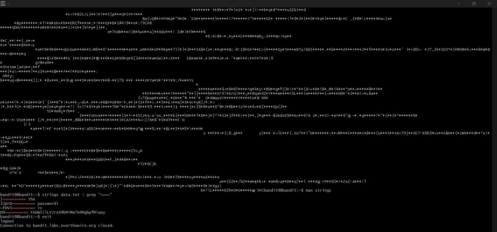

# Bandit Level 9 --> Level 10
#### Goal: The password for the next level is stored in the file data.txt in one of the few human-readable strings, preceded by several ‘=’ characters.
#### Username: bandit10
#### Password: FGUW5ilLVJrxX9kMYMmlN4MgbpfMiqey
#### Steps: To find the password from the file we combine the command 'strings' and 'grep' like- 'strings data.txt | grep "====". The command 'strings' first extracts the few human-readable lines from 'data.txt' and then feeds those lines to 'grep "===="' which finds the lines with several '=' preceding them.

