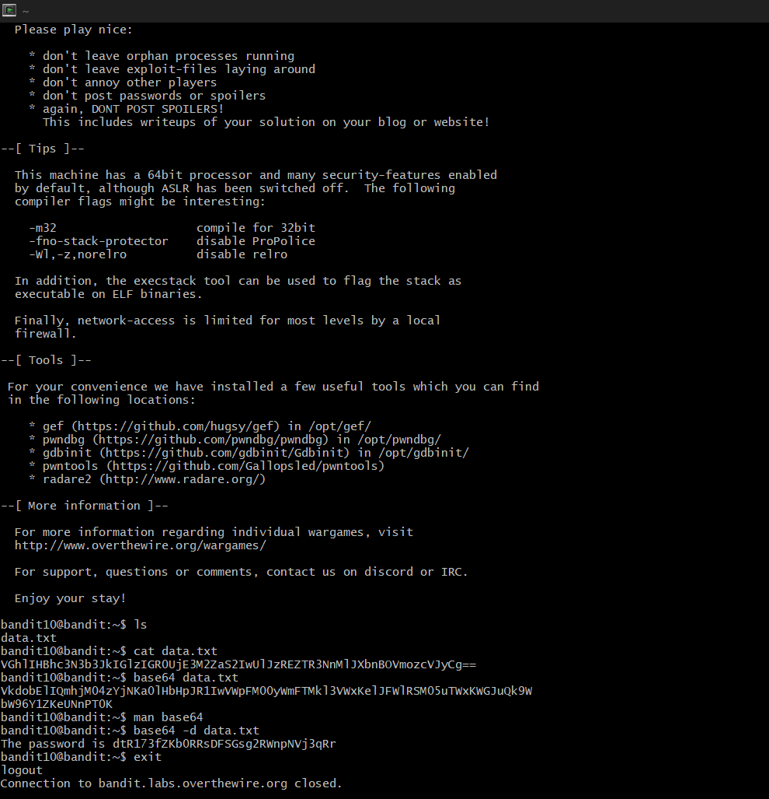

# Bandit Level 10 --> Level 11
#### Goal: The password for the next level is stored in the file data.txt, which contains base64 encoded data.
#### Username: bandit11
#### Password: dtR173fZKb0RRsDFSGsg2RWnpNVj3qRr
#### Steps: The data in 'data.txt' is said to be base64 encoded, so we decode using a simple command 'base64 -d data.txt' and then get the password. 

