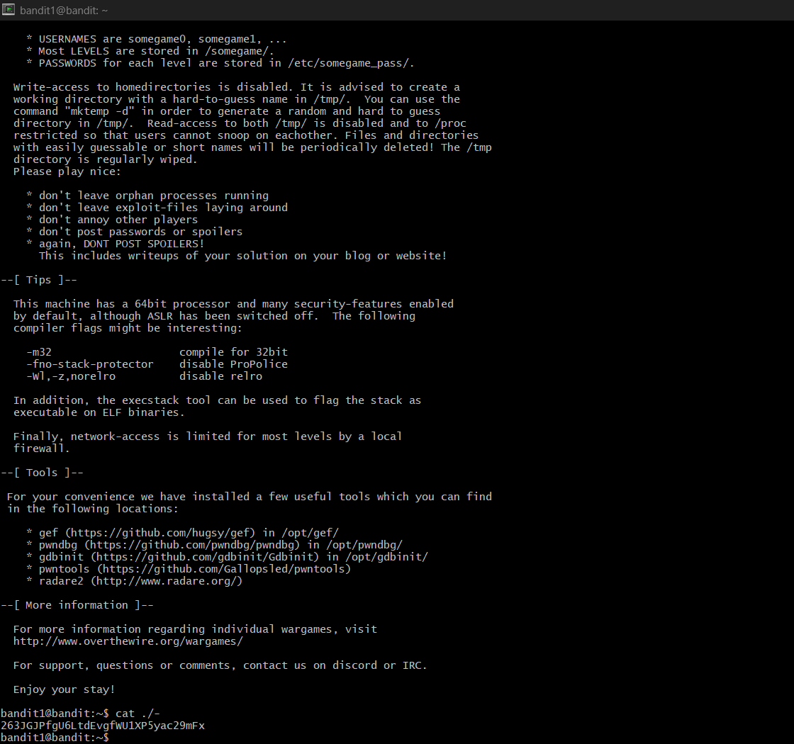

# Bandit Level 1 --> Level 2

#### Goal: Progress to Level 2 by finding a file '-' located in home directory
#### Username: bandit2
#### Password: 263JGJPfgU6LtdEvgfWU1XP5yac29mFx
#### Steps: The '-' file is located in the current directory, so we simply enter it using the command 'cat ./-'. ./ are added before a dashed filename to access it. 

