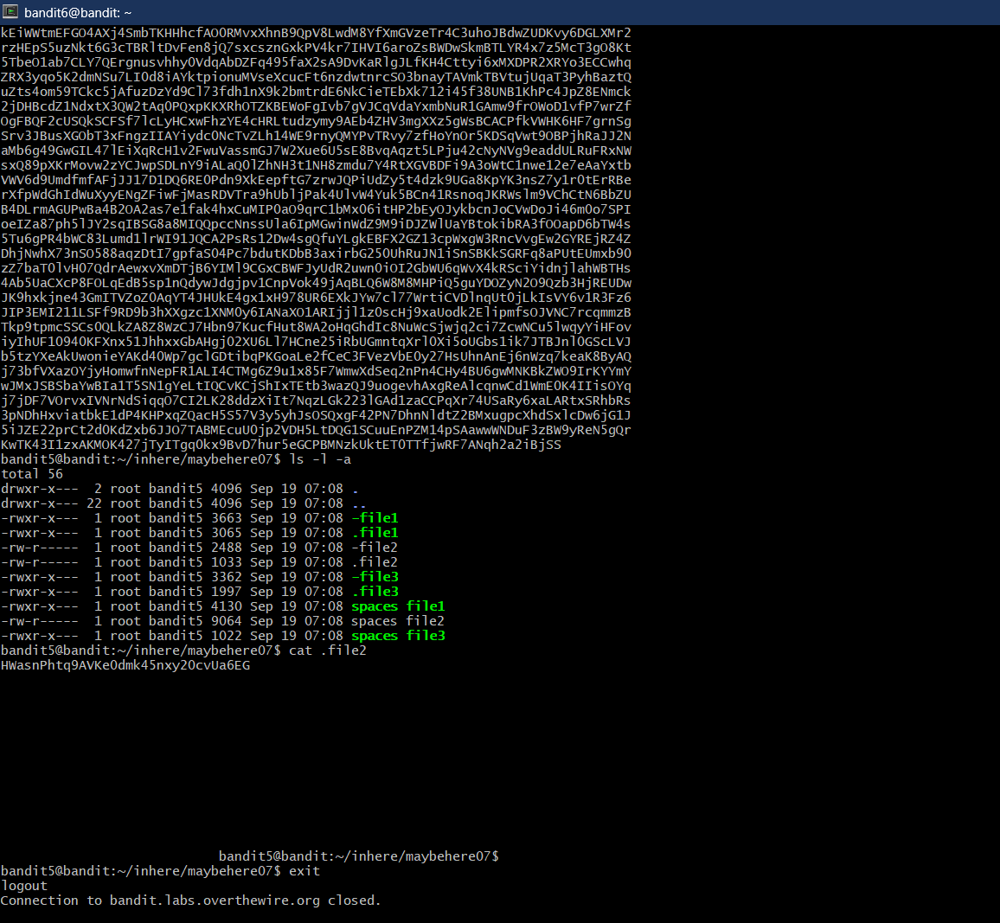

# Bandit Level 5 --> Level 6
#### Goal: Search for the password hidden in the file of the following properties- human-readable, 1033 bytes in size and non-executable. 
#### Username: bandit6
#### Password: HWasnPhtq9AVKe0dmk45nxy20cvUa6EG
#### Steps: After checking all the files in each of the directories in 'inhere' using the command 'ls -a -l' we check for the non-executable files (hidden and non-hidden) by looking for the absence 'x' in the file permission details. The password is found in the hidden file '.file2' in the 'maybehere07' directory. 

