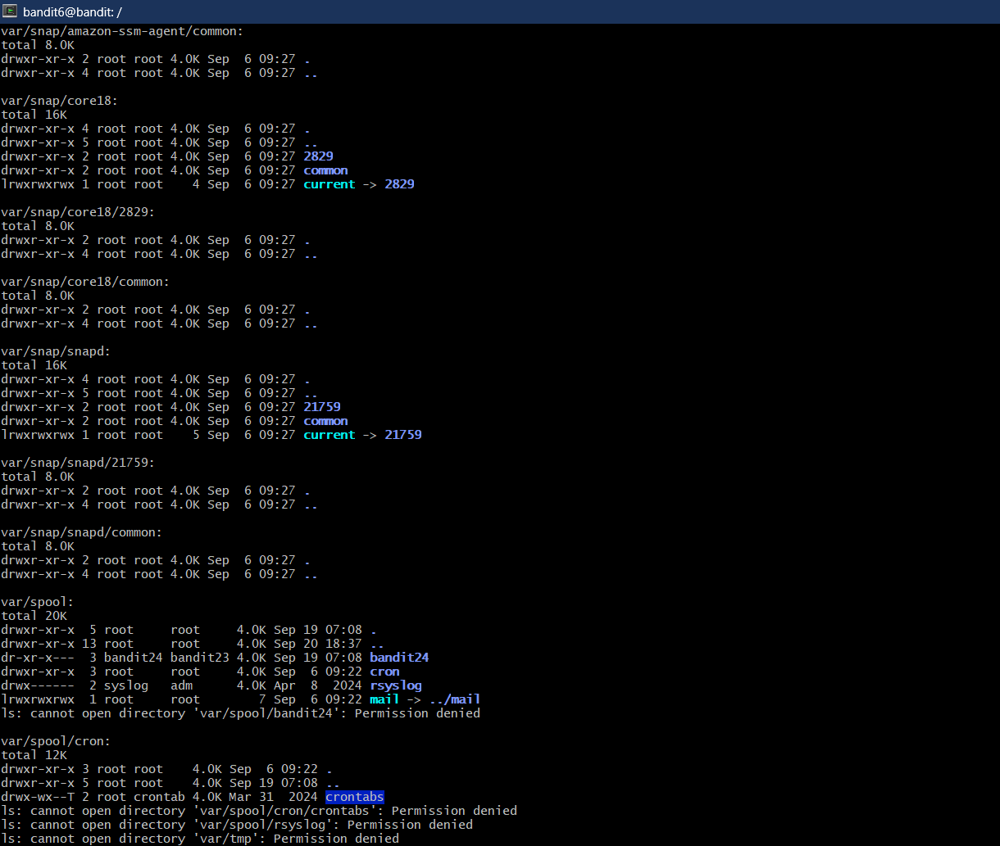
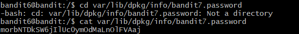

# Bnadit Level 6 --> Level 7

#### Goal: Find the password stored somewhere in the server in a file owned by user 'bandit7' and group 'bandit6', and is 33 bytes in size.
#### Username: bandit7
#### Password: morbNTDkSW6jIlUc0ymOdMaLnOlFVAaj
#### Steps: Using the ls command and its suboptions, list all the files in all the directories in the root. 'ls -a -lh -S -R'. This command will give a very long list of files and folders and as we browse through the list, we'll find a file owned by bandit7 and bandit6 user and group, respectively. The password is in the file 'bandit7.password' found in the path 'var/lib/dpkg/info/bandit7.password'. 

