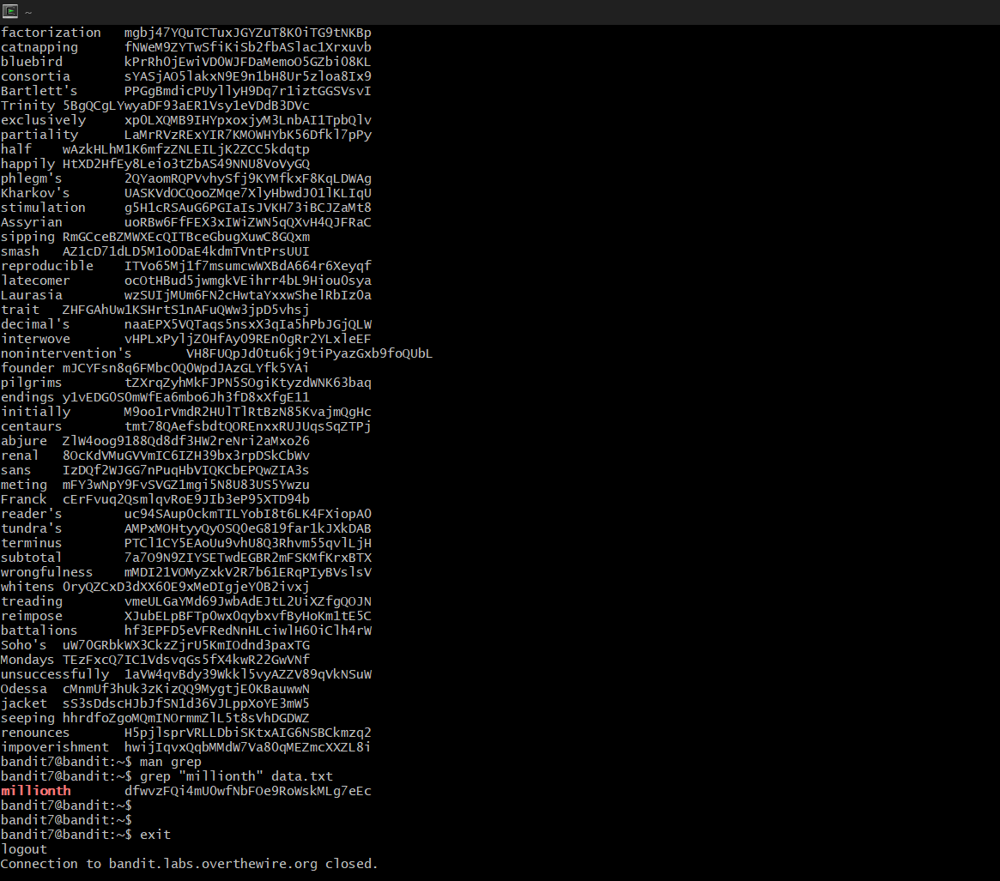

# Bandit Level 7 --> Level 8
#### Goal: Find the password in the file data.txt next to the word millionth. 
#### Username: bandit8
#### Password: dfwvzFQi4mU0wfNbFOe9RoWskMLg7eEc
#### Steps: The 'data.txt' file is present in the current directory itself, so we simply use the 'grep' command to search for the line/s with the word 'millionth' in it/them. The input is something like 'grep "millionth" data.txt', which results in just one line containing the password after the word 'millionth'. 

